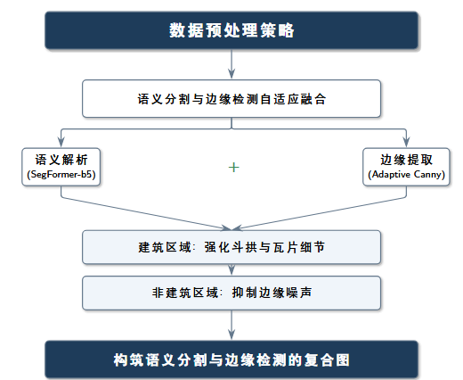
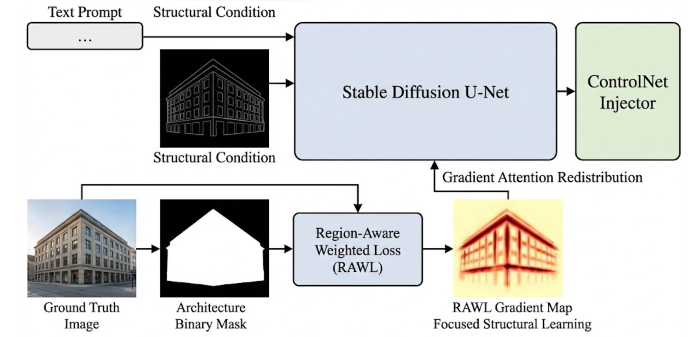
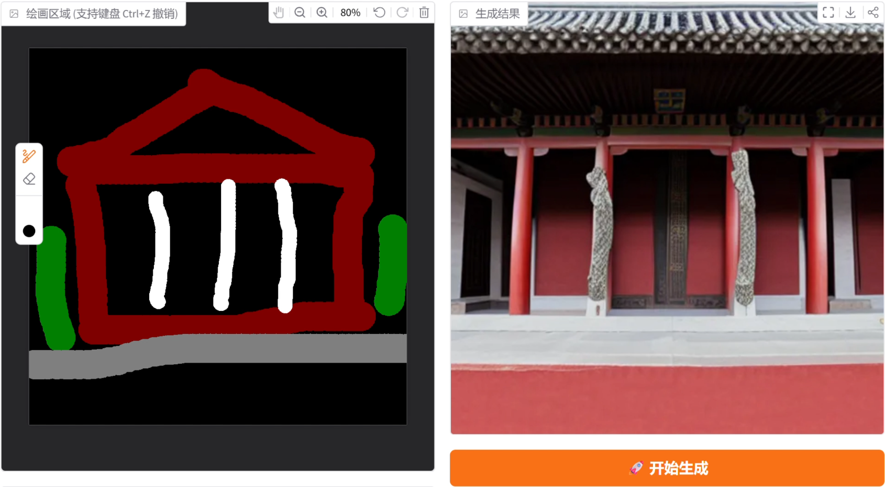
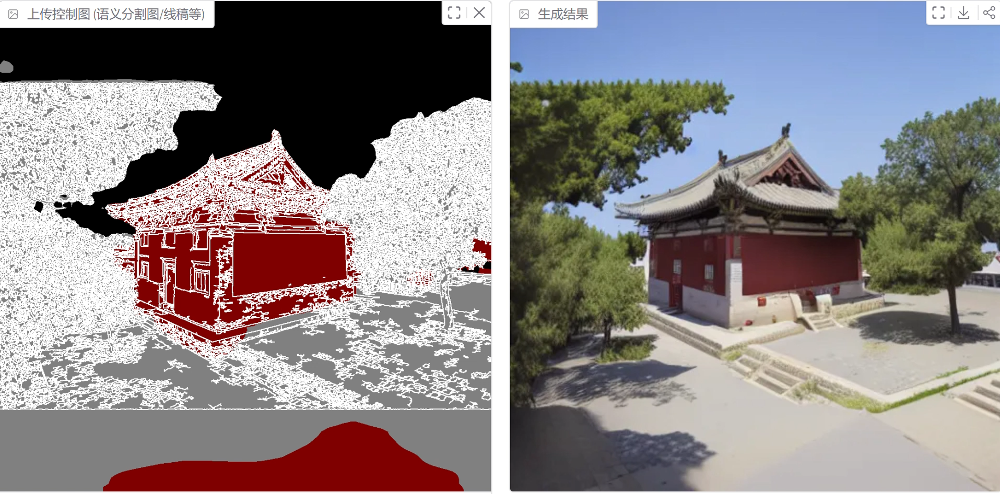

# Ancient Chinese Architecture Generation based on Region-Aware ControlNet
# 基于区域感知加权 ControlNet 的中国古建筑可控生成

[](https://www.python.org/)
[](https://pytorch.org/)
[](https://gradio.app/)
[](LICENSE)

> 中山大学智能工程学院 - 深度学习实验报告（第二组）

## 📖 项目介绍 (Introduction)

本项目针对通用扩散模型（如 Stable Diffusion）在中国古建筑生成任务中存在的“结构幻觉”（如屋脊断裂、斗拱悬空）和“纹理优先”问题，提出了一种结合**区域感知加权损失（RAWL）**与**语义引导边缘提取**的 ControlNet 改进方案。

通过显式地将建筑主体结构作为梯度的重点优化对象，并结合语义掩码过滤背景噪声，本模型能够在保持古建筑形制严谨性的同时，实现照片级的高质量渲染。

### ✨ 核心特性 (Key Features)

*   **区域感知加权损失 (RAWL)**: 通过语义分割掩码构建空间权重矩阵，将梯度预算集中在建筑主体区域，解决背景纹理（如树木、天空）干扰结构学习的问题。
*   **多模态条件融合**: 结合 `SegFormer` 语义分割与自适应 `Canny` 边缘检测，构建“语义掩码 + 结构边缘”的复合控制信号，有效抑制树叶等高频噪声对建筑结构的误导。
*   **交互式可视化系统**: 基于 Gradio 搭建的 Web UI，支持**手绘草图**和**上传语义图**两种模式，实现端到端的古建筑可控生成。

## 🏗️ 方法论 (Methodology)

### 1. 数据预处理流水线
我们提出了一种语义引导的边缘提取策略：
$$
E_{\text{arch}} = E \odot G
$$

其中，$E$ 表示原始边缘图，$G$ 表示空间引导掩码（guidance mask），$\odot$ 表示逐元素相乘（Hadamard product）。


### 2. 模型架构与 RAWL
基于 Stable Diffusion v1.5 + ControlNet，引入自定义损失函数：
$$
\mathcal{L}_{\text{ours}} =
\mathbb{E}\left[
\frac{
\sum_{i,j} W_{i,j} \cdot
\left\lVert \epsilon_{i,j} - \epsilon_{\theta,i,j} \right\rVert_2^2
}{
\sum_{i,j} W_{i,j} + \varepsilon
}
\right]
$$


## 📊 实验结果 (Results)

在独立测试集上的定量评估表明，本方法在结构一致性和图文匹配度上均优于基线模型。

| 模型 | FID ($\downarrow$) | CLIP Score ($\uparrow$) | 备注 |
| :--- | :---: | :---: | :--- |
| **Ours** | **34.6294** | **24.1465** | 结构更完整，伪影更少 |
| SOTA Benchmark | < 10 | > 30 | (参考基准) |




## 🛠️ 安装与使用 (Installation & Usage)

### 环境要求
*   Python 3.8+
*   PyTorch 2.0+
*   NVIDIA GPU (建议 12GB+ 显存)

### 1. 克隆仓库与安装依赖
```bash
git clone https://github.com/ljf-bit/DL-SD-controlnet.git

# 推荐使用 conda 创建环境和添加依赖
conda env create -f environment.yaml